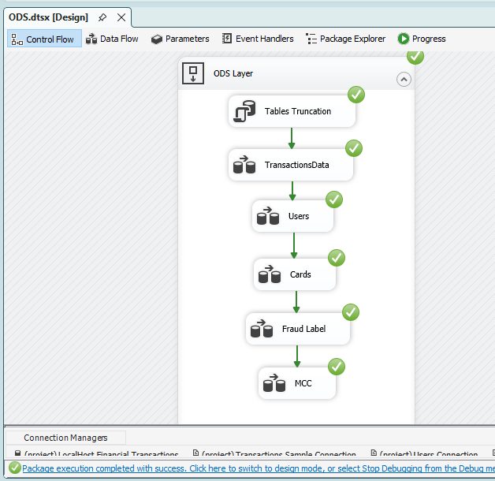
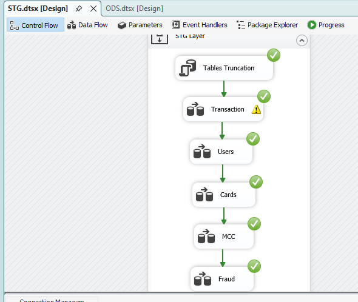

# Financial Transactions Data Warehouse & Fraud Analytics


---

## Project Overview

This project is an end-to-end **Data Engineering and Business Intelligence** solution for analyzing financial transactions and fraud activity.

The project starts with raw **CSV and JSON datasets**, followed by ETL processing using **SQL Server Integration Services (SSIS)**, data cleansing and transformation through **ODS, STG, and DWH layers**, and the development of a **Star Schema Data Warehouse** in SQL Server.

The solution supports both **Full Load and Incremental Load** processing, with automated ETL execution using **scheduled jobs**.

The final Data Warehouse is connected to **SSAS Tabular** to create a semantic model and then connected to **Power BI** to provide interactive dashboards and business insights.

---

# Dashboard Preview


---

# Project Workflow

```text
Raw CSV / JSON Files
        │
        ▼
ODS Layer
        │
        ▼
STG Layer
        │
        ▼
Data Warehouse
        │
        ▼
SSAS Tabular Model
        │
        ▼
Power BI Dashboard
        │
        ▼
Business Insights
```

The pipeline supports both **Full Load** and **Incremental Load** processing.

```text
                 ETL Pipeline
                      │
            ┌─────────┴─────────┐
            ▼                   ▼
        Full Load        Incremental Load
            │                   │
            ▼                   ▼
      Initial Load       New Data Processing
```

---

# Technologies Used

- SQL Server
- SQL
- SSIS
- SSAS Tabular
- Power BI
- Power Query
- DAX
- Stored Procedures
- Star Schema
- ETL
- Full Load
- Incremental Load
- Job Scheduling
- Data Warehousing

---

# Data Sources

The project uses the **Transactions Fraud Dataset** from Kaggle.

Dataset:

https://www.kaggle.com/datasets/computingvictor/transactions-fraud-datasets

### Source Files

- Users.csv
- Cards.csv
- Transactions.csv
- TrainFraudLabel.json
- MCC.json

The dataset contains:

- Customer information
- Payment card information
- Financial transactions
- Merchant information
- Fraud labels
- Merchant Category Codes (MCC)

---

# ETL Pipeline

The ETL process was developed using **SQL Server Integration Services (SSIS)** and is divided into three main layers.

```text
Source Files
     │
     ▼
    ODS
     │
     ▼
    STG
     │
     ▼
    DWH
```

---

# ODS Layer

The **Operational Data Store (ODS)** layer is responsible for loading and storing the raw source data.

### Responsibilities

- Source data ingestion
- CSV and JSON loading
- Raw data preservation
- Initial data loading
- Incremental data ingestion

## Full Load

The initial Full Load process loads the source data into the ODS layer.



## Incremental Load

After the initial load, the ODS layer processes newly available records using an incremental loading strategy.


---

# STG Layer

The **Staging (STG)** layer is responsible for data cleansing, standardization, validation, and transformation.

### Main Transformations

- Data type conversion
- Removing unnecessary spaces
- Currency cleaning
- ZIP code formatting
- NULL handling
- Text standardization
- Data validation
- Business transformations
- Preparing data for the Data Warehouse

## Full Load



## Incremental Load

The STG incremental pipeline processes only the new records received from the ODS layer.


---

# Data Warehouse

The final Data Warehouse was designed using a **Star Schema** optimized for analytical reporting.

### Fact Table

- FactTransactions

### Dimension Tables

- DimClients
- DimCards
- DimMerchant
- DimDate
- DimMCC
- DimFraud

---

## Star Schema


---

# Full Load

The Full Load process is responsible for the initial population of the Data Warehouse.

The loading process includes:

- Loading dimension tables
- Generating surrogate keys
- Lookup transformations
- Resolving dimension relationships
- Loading fact transactions

### Dimension Loading

#### DimCards


#### DimClients


#### DimFraud


#### DimMCC


#### DimMerchant


### FactTransactions

The fact table is populated after resolving the required dimension keys.


---

# Incremental Load

After the initial Full Load, the project uses an **Incremental Load** strategy to process new data without reloading the entire dataset.

```text
                 Incremental Load
                        │
                        ▼
                New Source Data
                        │
                        ▼
              ODS Incremental Load
                        │
                        ▼
              STG Incremental Load
                        │
                        ▼
              DWH Incremental Load
```

The incremental strategy helps reduce processing time and database workload as the amount of source data increases.

### Incremental SSIS Packages

- ODS Incremental Load.dtsx
- STG Incremental Load.dtsx
- DWH Incremental Load.dtsx


---

# Incremental Processing

The incremental pipeline was implemented for multiple entities across the Data Warehouse.

## Cards

### ODS


### STG


### DWH


---

## Users

### ODS


### STG


### DWH


---

## Transactions

### ODS


### STG


### DWH


---

## Fraud

### ODS


### STG


### DWH


---

## MCC

### ODS


### STG


---

# Automation & Job Scheduling

The ETL pipeline was automated using **scheduled jobs** to reduce manual intervention and provide a more production-oriented workflow.

The automated workflow follows this sequence:

```text
                  Scheduled Job
                       │
                       ▼
             ODS Incremental Load
                       │
                       ▼
             STG Incremental Load
                       │
                       ▼
             DWH Incremental Load
                       │
                       ▼
                SSAS Processing
                       │
                       ▼
                   Power BI
```

## Job Scheduling

The ETL process is configured to execute automatically according to the defined schedule.


### Automation Benefits

- Automated ETL execution
- Reduced manual intervention
- Repeatable data processing
- Consistent data refresh
- Scheduled incremental processing
- Improved operational reliability

---

# SSAS Tabular Model

A semantic model was created using **SQL Server Analysis Services (SSAS) Tabular**.

The SSAS model provides a semantic layer between the Data Warehouse and Power BI.

### SSAS Features

- Relationships
- DAX Measures
- Calculated Columns
- Business Logic
- Analytical Modeling
- Semantic Layer

## SSAS Model


---

## SSAS Dimensions

### DimClients


### DimCards


### DimMCC


### DimMerchant


### DimFraud


---

# Power BI Dashboard

The Power BI dashboard consists of six analytical pages designed to provide a comprehensive view of financial transactions and fraud activity.

---

## Home Dashboard

The Home page provides the entry point to the analytics solution.


---

## Executive Overview

The Overview page provides a high-level summary of the most important financial and fraud KPIs.

### KPIs

- Total Transactions
- Total Transaction Amount
- Fraud Rate
- Fraud Amount
- Fraud Clients
- Fraud Cards

### Visuals

- Transaction Trends
- Fraud Trends
- Transaction Distribution
- Fraud Distribution


---

## Transactions Dashboard

The Transactions page analyzes financial transaction activity and spending behavior.

### KPIs

- Total Transactions
- Total Transaction Amount
- Average Transaction Amount

### Visuals

- Transaction Trends
- Transaction Distribution
- Merchant Performance
- Spending Analysis


---

## Fraud Dashboard

The Fraud page focuses on fraudulent transactions and fraud behavior.

### KPIs

- Fraud Transactions
- Fraud Amount
- Fraud Rate
- Fraud Clients
- Fraud Cards

### Visuals

- Fraud Trends
- Fraud by Merchant
- Fraud by Location
- Fraud by Card


---

## Customer Dashboard

The Clients page provides insights into customer behavior and spending patterns.

### Visuals

- Customer Spending
- Transaction Activity
- Customer Distribution
- Income vs Spending


---

## Cards Dashboard

The Cards page analyzes card usage, transaction activity, and fraud.

### Visuals

- Card Transaction Activity
- Card Spending
- Fraud by Card
- Card Brand Analysis


---

# Key Business Insights

The solution enables analysis of several important business questions:

- How do transaction volumes change over time?
- Which merchant categories generate the highest transaction volume?
- Which merchant categories have the highest fraud rates?
- Which locations have the highest fraud activity?
- Which customers have the highest spending?
- Which cards generate the highest transaction value?
- Which cards have the highest fraud activity?
- What is the relationship between income and spending?
- How does fraud behavior change over time?
- Which merchants have the highest transaction activity?

---

# Repository Structure

```text
Financial-Transactions/
│
├── SSIS/
│   │
│   ├── FullLoad/
│   │   ├── ODS.png
│   │   ├── STG.png
│   │   ├── DWH DimCards.png
│   │   ├── DWH DimClients.png
│   │   ├── DWH DimFraud.png
│   │   ├── DWH DimMCC.png
│   │   ├── DWH DimMerchant.png
│   │   └── DWH FactTransactions.png
│   │
│   ├── Incremental Load/
│   │   ├── Cards DWH.png
│   │   ├── Cards ODS.png
│   │   ├── Cards STG.png
│   │   ├── DWH Incremental.png
│   │   ├── Fact Transactions DWH.png
│   │   ├── Fraud DWH.png
│   │   ├── Fraud ODS.png
│   │   ├── Fraud STG.png
│   │   ├── Incremental Packages.png
│   │   ├── MCC ODS.png
│   │   ├── MCC STG.png
│   │   ├── ODS Incremental.png
│   │   ├── STG Incremental.png
│   │   ├── Transactions ODS.png
│   │   ├── Transactions STG.png
│   │   ├── Users DWH.png
│   │   ├── Users ODS.png
│   │   └── Users STG.png
│   │
│   ├── Financial Transaction.sln
│   ├── ODS.dtsx
│   ├── STG.dtsx
│   ├── DWH.dtsx
│   ├── ODS Incremental Load.dtsx
│   ├── STG Incremental Load.dtsx
│   ├── DWH Incremental Load.dtsx
│   └── Schedule job.png
│
├── SSAS/
│   ├── FinancialTransactions SSAS.sln
│   ├── Model.bim
│   ├── SSAS Model.png
│   ├── DimClients SSAS.png
│   ├── DimCards SSAS.png
│   ├── Dim Mcc SSAS.png
│   ├── DimMerchant SSAS.png
│   └── DimFraud SSAS.png
│
├── Power BI/
│   ├── Home.png
│   ├── Overview.png
│   ├── Transactions.png
│   ├── Fraud.png
│   ├── Clients.png
│   └── Cards.png
│
├── Database/
│   ├── Create Database.sql
│   ├── Star Schema.sql
│   └── Stored Procedures.sql
│
├── Data/
│   ├── Users.csv
│   ├── Cards.csv
│   ├── Transactions.csv
│   ├── MCC.json
│   └── TrainFraudLabel.json
│
└── README.md
```

---

# Skills Demonstrated

- Data Engineering
- ETL Development
- SQL Server
- SSIS
- Full Load
- Incremental Load
- Data Cleansing
- Data Transformation
- Data Warehousing
- Star Schema Design
- Fact & Dimension Modeling
- Surrogate Keys
- SSAS Tabular
- DAX
- Power BI
- Dashboard Design
- Business Intelligence
- ETL Automation
- Job Scheduling
- Analytical Data Modeling

---

# Future Improvements

- Implement advanced data quality checks.
- Add ETL execution monitoring and logging.
- Add failure notifications for scheduled jobs.
- Implement Slowly Changing Dimensions where required.
- Optimize incremental processing for larger data volumes.
- Deploy the solution to a cloud-based Data Platform.
- Integrate Power BI Service for automated report refresh.

---

# Author

**Mohamed Saber**

**Data Engineer | Data Analyst**

[LinkedIn](https://www.linkedin.com/in/mohamed-saber-b0a1231b3/)
